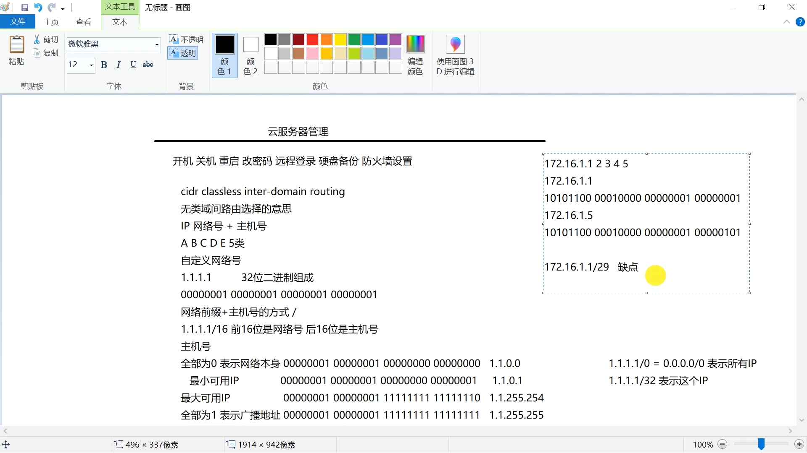

网站域名与云服务器
============

课程介绍
---------

随着互联网时代的发展，
越来越多的公司和个人想建立网站，
需要建站就离不开网站域名与服务器。  

如果大家去摸索，可能会走很多弯路，这节课希望大家学完后能少走弯路。  

本课程理论性、实用性都非常强，  
先用画图方式讲解理论知识，  
然后进行实践。

本课程主要内容有  

①网站域名购买与解析；  
②云服务器购买与管理；  
③环境安装与代码发布；  
④网站备案、经营许可与公网安备。  

课程大纲
---------

课程截图
---------

